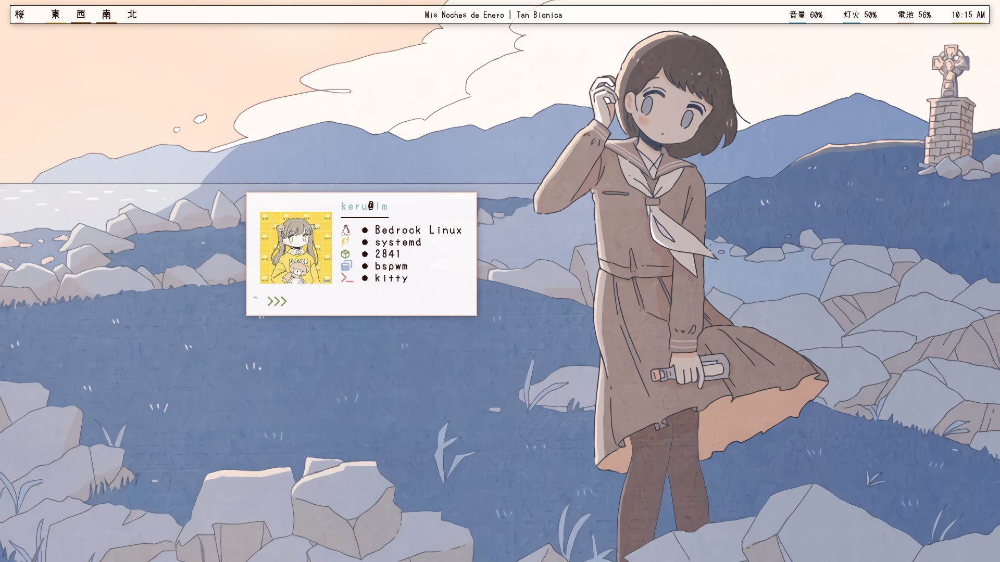

# bspwm 
Desktop #2

<p align="center">
  
</p>

<p align="left">WM : <a href="https://github.com/baskerville/bspwm/">bspwm</a></p>
<p align="left">Bar : <a href="https://github.com/polybar/polybar">Polybar</a></p>

### Installation

- Install BSPWM - [Instructions](https://github.com/baskerville/bspwm/)
- Install Polybar - [Instructions](https://github.com/polybar/polybar)
- Clone this repository
```
$ git clone --depth=1 https://github.com/keru3p/-2.git
```
- Copy everything from `config` directory to **`~/.config/`**
- Install the required fonts from **`fonts`** directory

